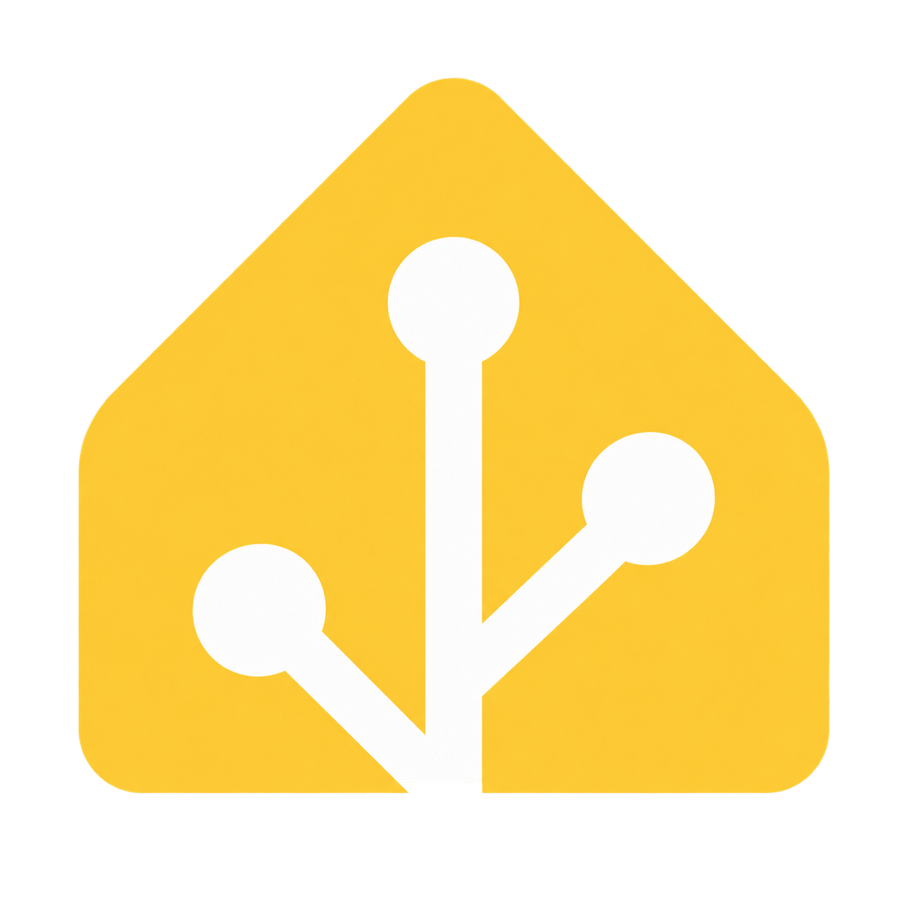

# Climastar Avant WiFi for Home Assistant

Home Assistant custom integration for Climastar Avant WiFi electric heaters. It uses the cloud backend used by the official Climastar Avant WiFi application; no API key, gateway ID, or developer credentials are required.



The repository/HACS logo is [`logo.png`](logo.png). Heater entities use the bundled transparent Avant heater artwork at `custom_components/climastar_avant/images/heater-transparent.png`.

## Features

- Discovers all supported gateways and installed heaters in an account.
- Exposes every heater as a native `climate` entity with current temperature, target temperature, 0.5 °C setpoint steps, heating/idle action, and availability.
- Receives live state through the cloud push connection, including reconnect handling.
- Supplies small read-only diagnostic sensors (PCB temperature, rated power, duty, error code) and window/presence binary sensors.
- Uses a refresh token during runtime and presents Home Assistant reauthentication if it is rejected.

Changing the target temperature uses the verified native `modified_auto` behavior of the official app. WebSocket state, rather than the write response, is authoritative.

### Energy dashboard

The verified cloud API reports a heater's configured/rated power, not cumulative energy use or live electrical draw. It is therefore deliberately not offered to the Home Assistant Energy dashboard: turning that value into kWh would produce misleading consumption figures. Use an energy-capable smart meter or plug for Energy dashboard reporting.

## Not yet supported

Schedule and away editing, boost, locking, True Radiant, window-detection settings, power-limit editing, and native off/manual/eco/frost modes are deliberately not exposed: their write semantics have not been verified. Use Home Assistant automations, external sensors, and thermostats to build your preferred control strategy.

## Install

### HACS

Add this repository as a custom repository in HACS (category **Integration**), install **Climastar Avant WiFi**, then restart Home Assistant.

### Manual

Copy `custom_components/climastar_avant` into your Home Assistant configuration directory's `custom_components` directory, then restart Home Assistant.

## Configure and reauthenticate

Go to **Settings → Devices & services → Add integration**, select **Climastar Avant WiFi**, and enter the email and password used by the official Avant WiFi app. Gateways and heaters are discovered automatically.

If the cloud rejects the saved authentication, Home Assistant creates a reauthentication repair. Open it and enter the current account credentials; deleting or restarting the integration is unnecessary.

## Troubleshooting

The entity is unavailable while the cloud connection, gateway, or heater is unavailable. A lost heater stays in the entity registry and becomes unavailable rather than disappearing.

For safe debug logs, add the following to `configuration.yaml` and restart Home Assistant:

```yaml
logger:
  default: info
  logs:
    custom_components.climastar_avant: debug
```

Logs and diagnostics intentionally exclude passwords, tokens, authorization headers, and location data. Please include sanitized diagnostics and Home Assistant version when reporting an issue.
